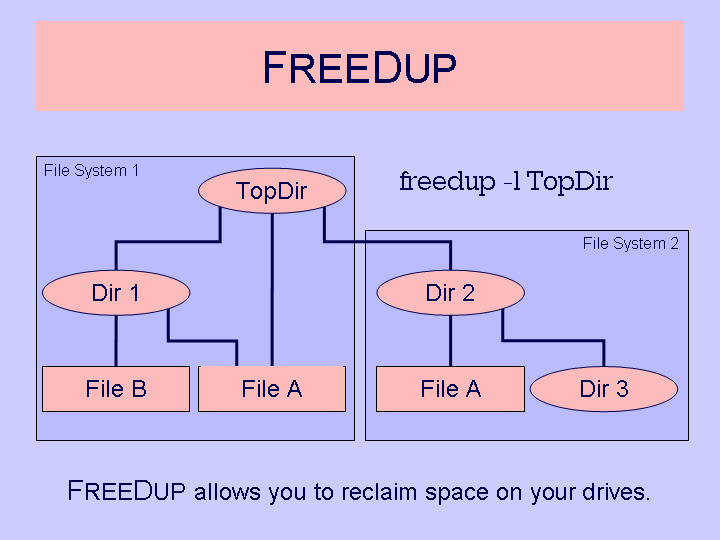

<h1 align="center">
  
  <br />
  FreeDup | <a href="https://github.com/sudo-give-me-coffee/freedup-mirror/releases/download/continuous/freedup">Download</a>
</h1>
<p align="center">Prepackaged as AppImage</p>

## What is?

Freedup walks through the file trees (directories) you specify.
When it finds two identical files on the same device, it hard links them together.
In this case two or more files still exist in their respective directories,
but only one copy of the data is stored on disk; both directory entries point to the same data blocks. 

<h1 align="center">
  
</h1>
If both files reside on different devices, then they are symlinked together.

## Basic Usage
```
freedup	<directory>
```

## Advanced Usage
```
freedup	[options] [<tree> ...]
```

> Options are toggle switches. Their final state applies.
> Later <tree> entries are linked to the earlier ones.
> Providing no <tree> means to take filenames(!) from stdin.
> When standard input is used the option -o has no effect.
> FreeDup Version 1.5-3 by AN@freedup.org ©2007-2009.
> Sha1 Version 1.0.4 by Allan Saddi ©2001-2003. 
 
### Option Categories
#### File Comparison
```
-a         provide compatibility to freedups by William Stearns.[=-gup]
-d         requires the modification time stamps to be equal.
-D <sec>   allow the modification time stamps to differ by not more than <sec> seconds.
-f         requires the path-stripped file names to be equal.
-g         requires groups to be equal.
-p         requires file permissions to be equal.
-P <mask>  set permission <mask> to an octal number, which indicates the permissions that need to be identical when comparing files.
-u         requires users to be equal.
 
```
#### Comparison Style
```
-x <style>  where style means what kind of containers freedup should look for before processing, i.e. the calculation of hashsums and comparison.
            mp3 ignores mp3v1 and mp3v2 tags
            mp4 ignores all mpeg containers except the first sequence of mdat ones
            mpc ignores mouse pack trailing tags
            jpg ignores jpeg header tags (including quantizazion)
            ogg ignores OggS header and short trailing tags
            auto selects one of above methods when appropriate
```

#### 	Hash Functions
```
-t <type>       selects an external hash method. Valid choices are sha512, sha384, sha256, sha224, sha1, md5, sum . External hash functions are not supported with comparison styles.
-# <level>      with level one of 0, 1, or 2. Controls the way that hash functions are used. Independently all files are compared byte by byte. Default is 2, which results in a fast hash function calculation during byte-by-byte comparision. This needs some more memory and the same or less time than level 0, which does not evaluate any hash values. Level 1 is needed to evaluate hash functions before comparing a pair of files. External hash functions require level 1 (higher levels are lowered automatically). A side effect of level 0 is to disable external hash functions.
```
#### Reporting
```
-c      count file space savings per linked file.
-h      shows this help and the long option names. [other option are ignored]
-H      shows all identical files whether already linked or not. Use it with -n.
-q      produces no output during the run (also toggles -c and -v to off)
-v      display shell commands to perform linking [verbose].
```

#### Actions
```
-l      only allow hardlinks. No symlinks are established.
-n      do not really perform links [no action].
-s      generate symlinks although some given paths are relative.
-w      only weak symbolic links allthough hardlinks might be possible.
-T      when linking, keep the directories' modification and access time.
-0      disable linking of empty files i.e. files of size 0.
```

#### Link Directions
```
-k "<key>"      Use key to define link direction, where key is one of ...
                @  link all identical files to the one which has already the most links.
                #  link all identical files to the first one that occured on commandline.
                <  link all identical files to the oldest one in the set.
                >  link all identical files to the newest one in the set.
                -  link all to the smallest one when using extra styles (like < otherwise).
                +  link all to the biggest one when using extra styles (like > otherwise).
                else  link identical files arbitrarily (to first in unsorted list).
                You should pay attention on masking these characters like '#' or \# 
```

#### General Behaviour
```
-b <path>   set current working directory to the given path.
-e <env>    load an environment set, i.e. some stored default settings. If not present, it will be stored. Please note, that the environment setting are loaded at its position in the command line, but stored after all settings were performed. Only the directories from the command line will be stored.
-i          decide in interactve mode what to do with identical files.
-m <bytes>  only touch larger files. (deprecated: use -o -size +#c)
-o <opts>   pass one option string to the initially called find command (last given string applies). If not given an interal function is called instead of find.
<tree>      any directory tree to scan for duplicate files recursively.
```
